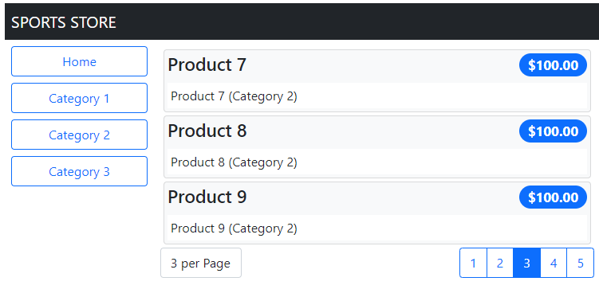

# Introduction 
Following Pro Angular 5th book to learn angular.

The github repository location of the book: `https://github.com/Apress/pro-angular-5ed`

## Links

- Bootstrap framework `https://getbootstrap.com/`
- Font Awesome `https://fontawesome.com/`
- JSON Web Token (JWT) specification `https://datatracker.ietf.org/doc/html/rfc7519`
- Google icons `https://fonts.google.com/icons`

## Application Urls

- SportsStore url `http://localhost:4200/`

- SportsStore administration url `http://localhost:4200/admin/auth`

- Json server url, listing products `http://localhost:3500/products`

- Json server url, listing orders `http://localhost:3500/db`

## Administration Credentials
The name is `admin` and password is `secret`.


## Commands (chapters 1, 2)

- npm version
```
npm -v
```

- Installing the Angular Development Package
```
npm install --global @angular/cli@13.0.3
```

- Creating a New Angular Project

```
ng new todo --routing false --style css --skip-git --skip-tests
```

- Starting the Angular Development Tools

```
ng serve
```

Another option
```
ng serve --open
```


- Adding the Angular Material Package

```
ng add @angular/material@13.0.2 --defaults
```

- Installing the Bootstrap CSS Package (run the command inside the folder project)

```
npm install bootstrap@5.1.3
```

-  Changing the Application Configuration Using PowerShell

```
Set-ExecutionPolicy Bypass -Scope Process -Force;
ng config projects.Primer.architect.build.options.styles '[""src/styles.css"", ""node_modules/bootstrap/dist/css/bootstrap.min.css""]'
```

## Commands (chapters 5, 6, 7)
- Installing the Additional NPM Packages

```
cd SportsStore
npm install bootstrap@5.1.3
npm install @fortawesome/fontawesome-free@6.0.0
npm install --save-dev json-server@0.17.0
npm install --save-dev jsonwebtoken@8.5.1
```

-  Adding the CSS Style Sheets to the Application

```
cd SportsStore
Set-ExecutionPolicy Bypass -Scope Process -Force;
ng config projects.SportsStore.architect.build.options.styles '[""src/styles.css"", ""node_modules/@fortawesome/fontawesome-free/css/all.min.css"", ""node_modules/bootstrap/dist/css/bootstrap.min.css""]'
```

- Checking the Configuration Changes

```
ng config projects.SportsStore.architect.build.options.styles
```

- Starting the RESTful Web Service

```
cd SportsStore
npm run json
```

- Installing the Component Library Package (you need to stop ng serve)

```
cd SportsStore
ng add @angular/material@13.0.2
```


## Chapter 05 - some images of the application

1. Basic features in the SportsStore application


2. Displaying product information


3. Selecting product categories


4. Adding pagination



## Chapter 06 - some images of the application

1. Adding cart


2. Shopping cart


3. Checkout form


## Chapter 07 - some images of the application

1. Administration login


2. Administration layout structure

