# Introduction 
This is chapter 07. We will learn how to create a real application.

## dotnet commands

1. To create the web project
```
dotnet new globaljson --sdk-version 6.0.403 --output SportsSln/SportsStore
dotnet new web --no-https --output SportsSln/SportsStore --framework net6.0
dotnet new sln -o SportsSln
dotnet sln SportsSln add SportsSln/SportsStore

```

2. To create the unit test

```
dotnet new xunit -o SportsSln/SportsStore.Tests --framework net6.0
dotnet sln SportsSln add SportsSln/SportsStore.Tests
dotnet add SportsSln/SportsStore.Tests reference SportsSln/SportsStore
```

3. Adding Moq nuget package
```
dotnet add SportsSln/SportsStore.Tests package Moq --version 4.16.1
```

4. To use Microsoft SQL Express using Docker
1. Create a folder to store database files. I have created _sql_ folder in the directory _C:\Dev_
2. Run the following command in a terminal window
```
docker run -e "ACCEPT_EULA=Y" -e "SA_PASSWORD=MyPass@word" -e "MSSQL_PID=Express" -p 1433:1433 -d --name=sql --mount type=bind,src=C:\Dev\sql,target=/var/opt/mssql/data mcr.microsoft.com/mssql/server:latest
```


5. To test a connection string create a file _TestConnectionString.udl_
1. After file creation, double click in the file
2. Select _Connection_ tab
3. On _server name_ type _localhost,1433_ 
4. On _Use a specific user name and password_ type _sa_
5. On _Select the database on the server_ select _master_
6. Click _Test Connection_

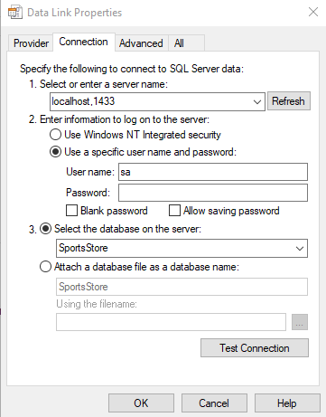

6. To define a connection string edit _appsettings.json_ file
```
"AllowedHosts": "*",
  "ConnectionStrings": {
    "SportsStoreConnection": "Persist Security Info=False;User ID=sa;Password=MyPass@word;Initial Catalog=SportsStore;Data Source=localhost,1433;MultipleActiveResultSets=true"
  }
```

7. Adding Entity Framework Core Packages. You need to execute the command in the _SportsStore_ folder
```
dotnet add package Microsoft.EntityFrameworkCore.Design --version 6.0.0
dotnet add package Microsoft.EntityFrameworkCore.SqlServer --version 6.0.0
```

8. Installing the Entity Framework Core Tool Packages
```
dotnet tool uninstall --global dotnet-ef
dotnet tool install --global dotnet-ef --version 6.0.0
```

9. Creating the database migration
```
dotnet ef migrations add Initial
```

10. Resetting the database
```
dotnet ef database drop --force --context StoreDbContext
```

11. After seeding data to the database

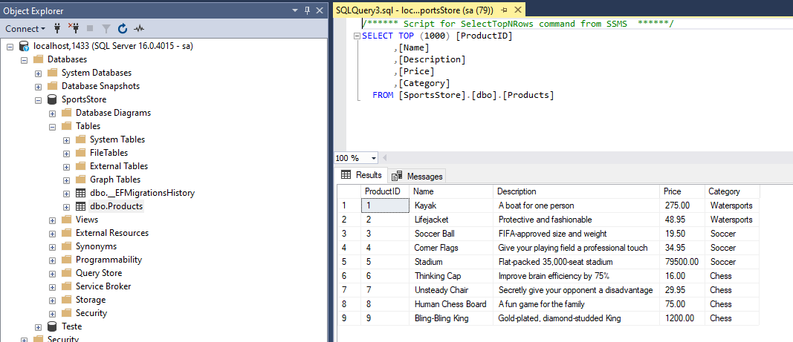


12. Installing the Bootstrap Package
```
dotnet tool uninstall --global Microsoft.Web.LibraryManager.Cli
dotnet tool install --global Microsoft.Web.LibraryManager.Cli --version 2.1.113
libman init -p cdnjs
libman install bootstrap@5.2.3 -d wwwroot/lib/bootstrap
```

13. Font Awesome packate, is an excellent set of open source icons. Run the following command in the directory _SportsSln\SportsStore_.

```
https://fontawesome.com/

libman install font-awesome@5.15.4 -d wwwroot/lib/font-awesome
```

14.  Creatint a migration that will create the Order table. Run this command in the directory _SportsSln\SportsStore_.
```
dotnet ef migrations add Order
```

15. Creatint a migration to update Order with shipped property
```
dotnet ef migrations add ShippedOrders
```

16. I did a mistake when creating ShippedOrders. I want to remove a migration that was applied to the database:
```
dotnet ef database update 20230411225200_Order
dotnet ef migrations remove
```
1. The first command, rollback the database to a previously migration, the migration _20230411225200_Order_
2. The second command removes the migration _20230415100918_ShippedOrders_ in the project.
3. If we run first the second command you can get this error message:
```
The migration '20230415120712_ShippedOrders2' has already been applied to the database. Revert it and try again. If the migration has been applied to other databases, consider reverting its changes using a new migration instead.
```

17. Installing the Identity Package for EntityFramework Core
```
dotnet add package Microsoft.AspNetCore.Identity.EntityFrameworkCore --version 6.0.0
```


## Chapter 07 and 08 - some images of the application

1. Displaying product details


2. Displaying product details with pagination

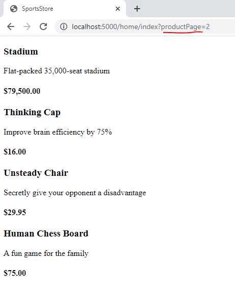


3. SportsStore application

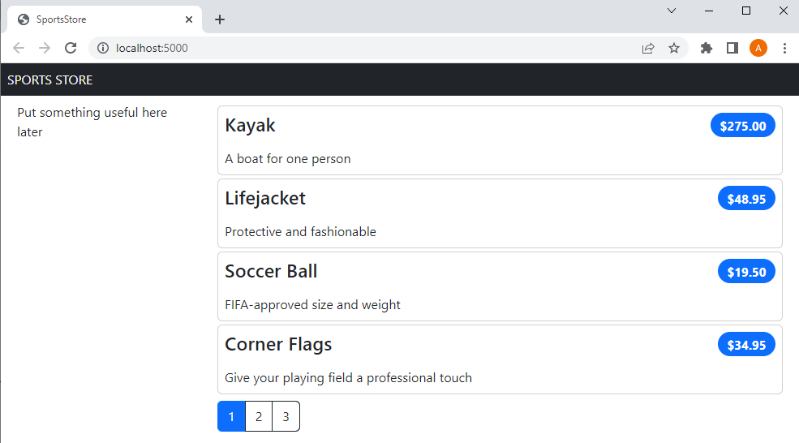

4. Add to cart button's

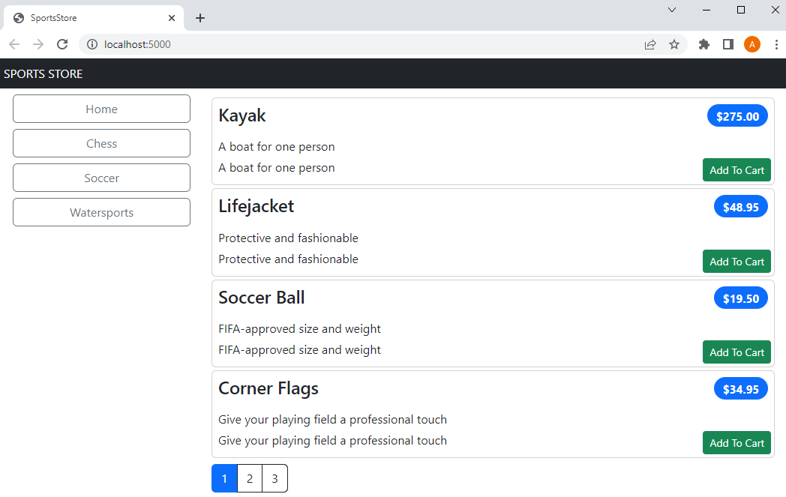

5. Shopping cart

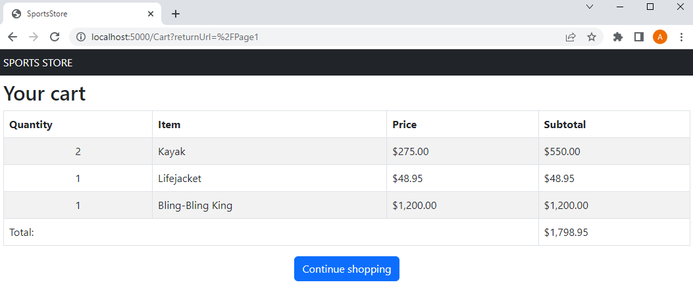

## Chapter 09 - some images of the application

1. Remove product button from cart

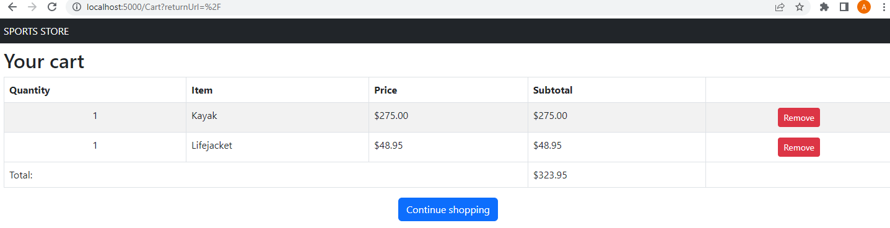

2. Cart summary widget

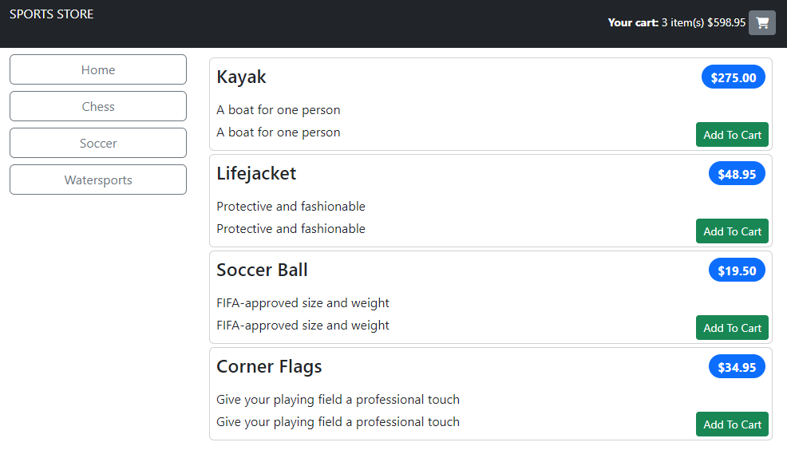

3. The checkout button

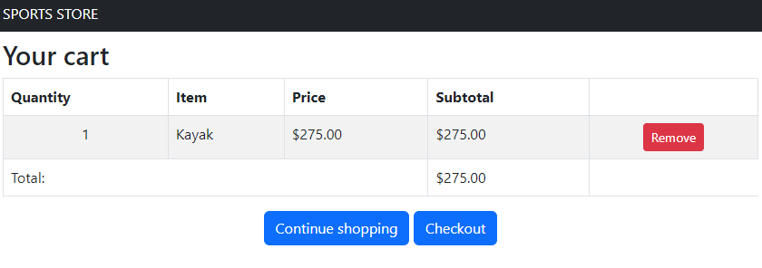

## Chapter 10 - some images of the application

1. Blazor setup 

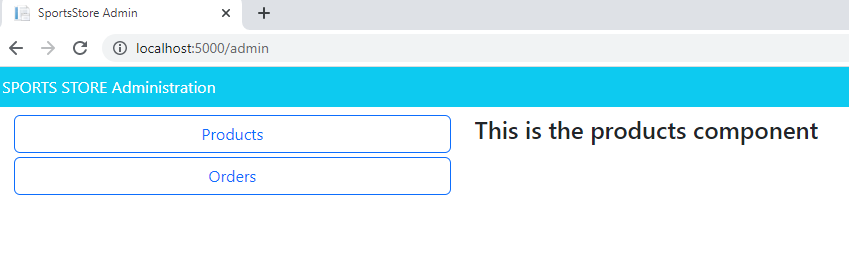

2. Orders administration

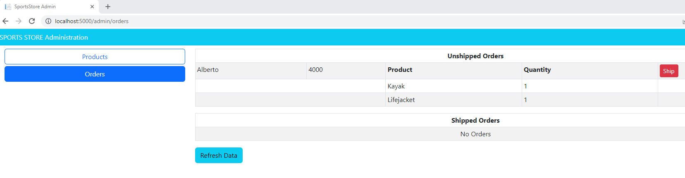

3. Products list administration

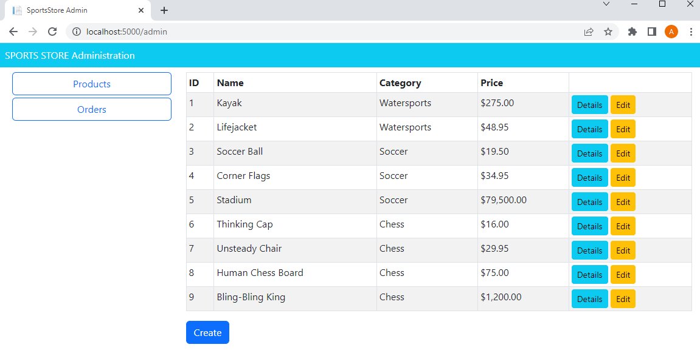

4. Product details administration

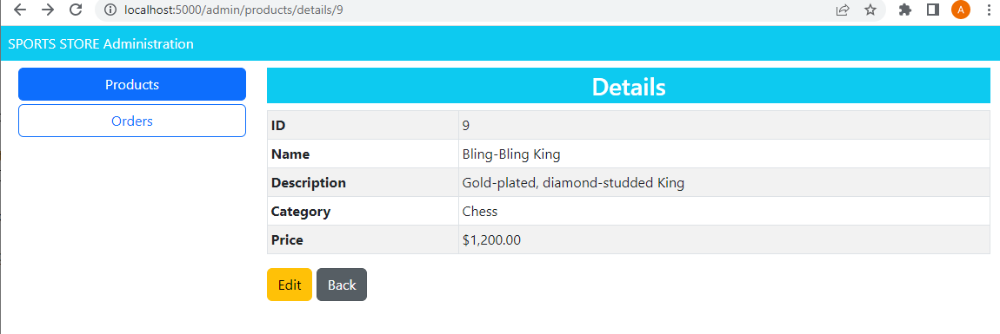

5. Using the editor to edit a Product in the administration

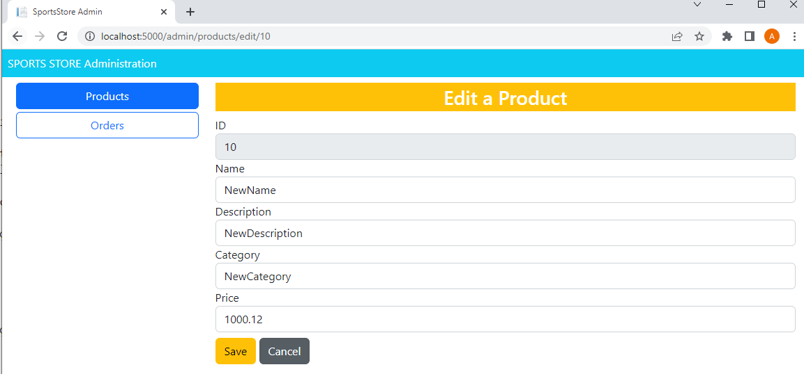

6. Product deletion in the administration

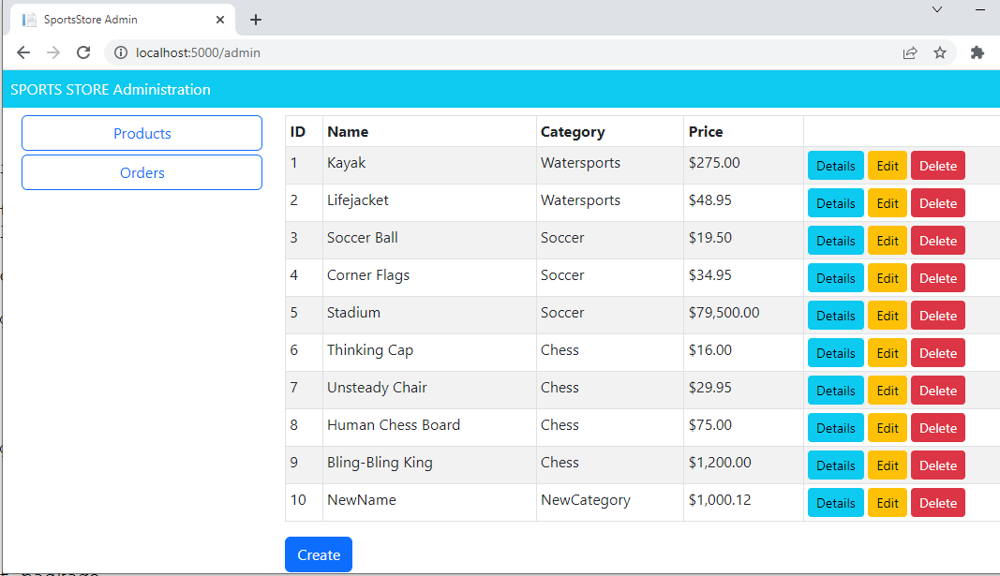

## Chapter 11 - some images of the application